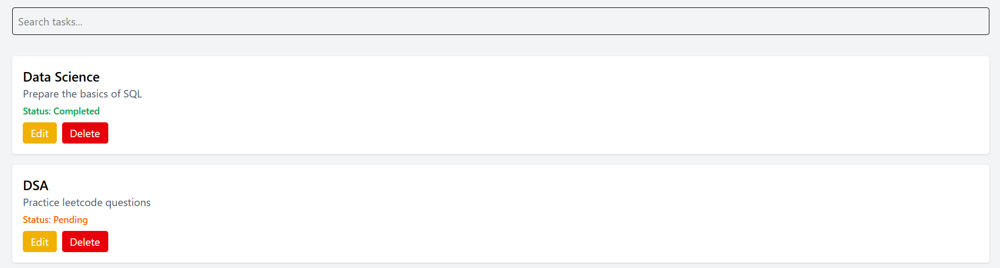
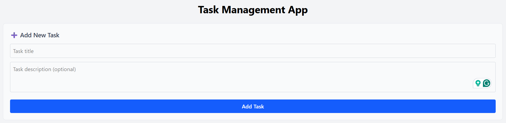
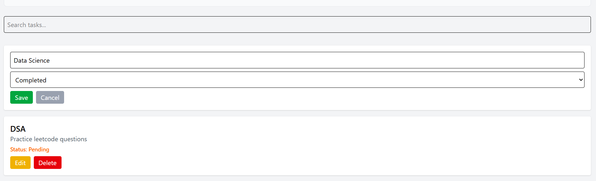
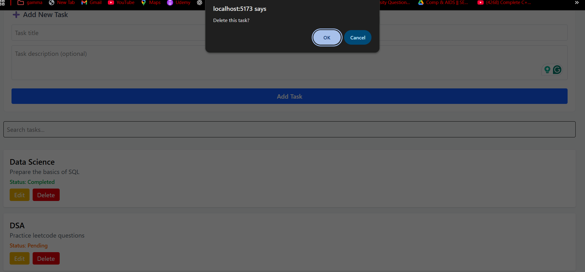

# 📝 Task Management Web Application

A full-stack Task Management web application that allows users to create, view, update, delete, and search tasks.

---

### 🚀 Features
* Add new tasks with a title and description
* View all tasks in a clean, card-based UI
* Edit task title and status (Pending / Completed)
* Delete tasks with confirmation
* Search tasks by title
* Responsive and user-friendly interface

---

### 🛠 Tech Stack

**Frontend**
* React (Vite)
* Tailwind CSS
* Axios

**Backend**
* Node.js
* Express.js

**Database**
* MongoDB (MongoDB Atlas)

**Tools**
* Git & GitHub

---

### 📂 Project Structure
```text
Task-Manager/
├── client/   → React frontend
├── server/   → Node.js backend
└── README.md
⚙️ Setup Instructions
1️⃣ Clone the repository
Bash
git clone <your-github-repo-link>
cd Task-Manager
2️⃣ Backend Setup
Bash
cd server
npm install
Create a .env file inside server/:

Code snippet
MONGO_URI=your_mongodb_connection_string
PORT=5000
Start backend server:

Bash
node index.js
3️⃣ Frontend Setup
Bash
cd ../client
npm install
npm run dev
Frontend runs on: http://localhost:5173

Backend runs on: http://localhost:5000

📸 Screenshots:

1.Task List UI

2. Add task form

3. Edit task

4. Delete confirmation



🌐 Live Demo: https://task-manager-peach-xi.vercel.app/

👨‍💻 Author

Shantanu Barge
Full Stack Developer (MERN)

This project focuses on clean architecture, simplicity, and usability while fulfilling all the requirements mentioned in the internship assignment.
